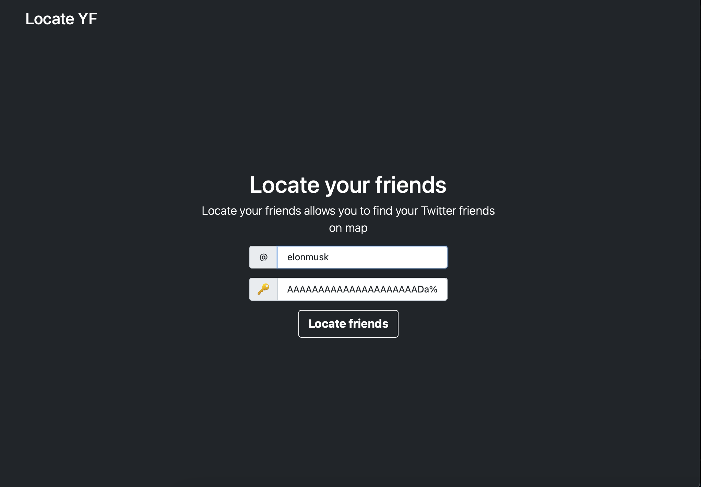
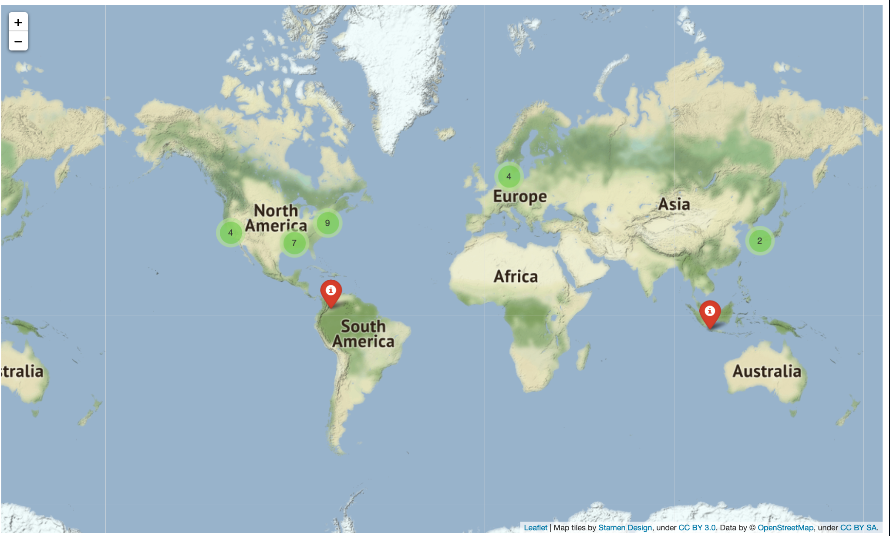

# Locate your friends

# http://bohdanhlovatskyi.pythonanywhere.com
web-application with which you can display on the map data (field "location") about friends (people you are subscribed to) of the specified account on Twitter.
<br>

By default it displays 25 friends (which is regulated by function that makes request)

Gets twitter bearer token from user to make it more comfortable to check

# Example of execution
```
Inputing the values
```

<br>
```
Result
```



